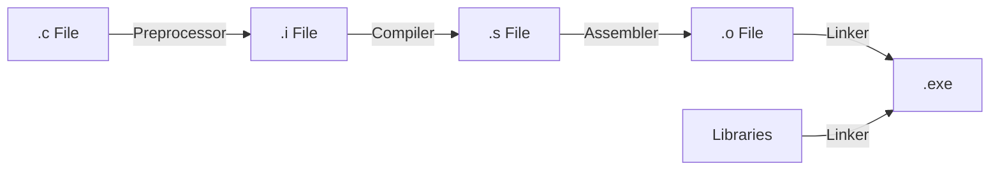

# The C Compilation Process

When you run a command like `gcc main.c -o app`, it looks like a single step. In reality, your code is traveling through a four-stage assembly line. Understanding this pipeline is essential for debugging linker errors and managing large projects.

---

## Stage 1: Preprocessing

The **Preprocessor** is a simple text-substitution tool. It looks for lines starting with a hash symbol (`#`).

-   **`#include`:** It literally copies and pastes the entire content of the header file (like `stdio.h`) into your code.
-   **`#define`:** It replaces macro names with their values.
-   **Output:** A large "expanded" source code file (often given the `.i` extension).

---

## Stage 2: Compiling

This is the "brain" of the operation. The **Compiler** takes the expanded source code and translates it into **Assembly Language**.

Assembly is a low-level language that maps directly to CPU instructions (like `MOV`, `ADD`, `PUSH`), but it is still readable by humans.

-   **Output:** An assembly file (often given the `.s` extension).

---

## Stage 3: Assembling

The **Assembler** takes the assembly code and translates it into **Machine Code** (0s and 1s). 

The output is called an **Object File**. It contains instructions the CPU understands, but it is not yet a complete program because it might be missing external functions (like `printf`).

-   **Output:** An object file (often given the `.o` or `.obj` extension).

---

## Stage 4: Linking

This is the final step. The **Linker** takes all your individual object files and combines them with **Libraries** (like the C Standard Library).

If you called `printf()` in your code, the Linker finds the machine code for `printf` inside the system libraries and "links" it to your program so the CPU knows where to jump when it hits that command.

-   **Output:** The final **Executable Binary** (e.g., `app` or `main.exe`).

---

## Visual Summary

## Practice Problems

??? question "Practice Problem 1: Stage Identification"

    At which stage does the computer replace the word `PI` with the value `3.14159` if you used `#define PI 3.14159`?

    ??? tip "Solution"
        **Preprocessing.** 
        
        The preprocessor handles all `#` directives before the actual "compiling" begins.

??? question "Practice Problem 2: Missing Functions"

    You write a program, but you forget to include the file where you defined a custom function. You get an error message that says: *"Undefined reference to 'my_function'"*. Which stage produced this error?

    ??? tip "Solution"
        **Linking.** 
        
        The compiler and assembler don't care where the function is defined; they just leave a "placeholder." The Linker is the one that searches for the definition. If it can't find it, it throws an "Undefined Reference" error.

## Key Takeaways

| Stage | Action | Output |
| :--- | :--- | :--- |
| **Preprocessing** | Text substitution (#). | Expanded Source. |
| **Compiling** | C to Assembly. | Assembly (.s). |
| **Assembling** | Assembly to Machine Code. | Object (.o). |
| **Linking** | Merging Objects and Libs. | Executable. |

---

By understanding the compilation pipeline, you can peek behind the curtain of "black box" build tools and understand exactly how your human-readable logic is forged into the physical reality of machine instructions.
